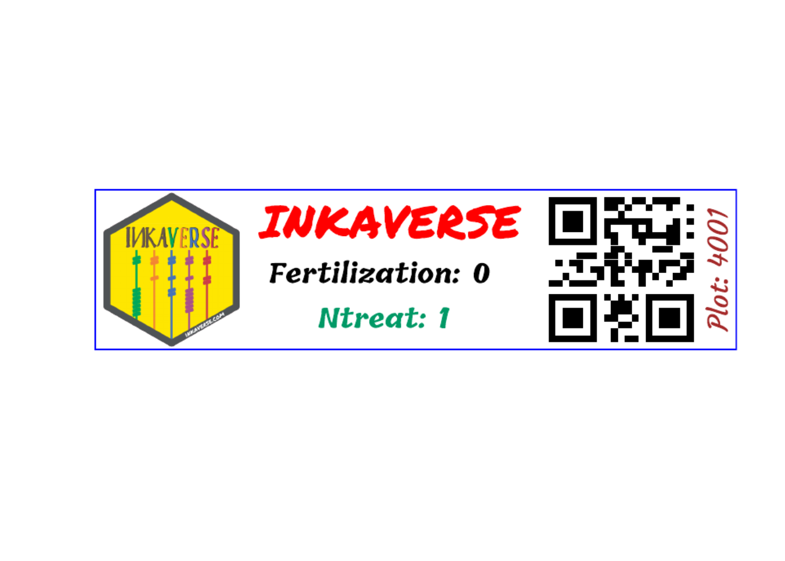

# Single-Factor Design: RCBD

Planning an experiment follows a reproducible routine:

1.  **Load required libraries:** Load `inti`, `knitr`, and `dplyr`
    packages.
2.  **Define factor levels:** Set up lists with genotypes, treatments,
    and management factors.
3.  **Dispatch design generator:** Choose between CRD, RCBD, Split-plot,
    or Augmented designs.
4.  **Plot the field sketch:** Verify spatial layouts and
    serpentine/zigzag sequences.
5.  **Label design:** Design the experimental labels to facilitate the
    data collection.
6.  **Export to Field Book app:** Generate field-ready sheets with trait
    parameters.

\
`# Install packages and dependencies`\
\
[`library`](https://rdrr.io/r/base/library.html)`(`[`inti`](https://inkaverse.com/)`)`\
[`library`](https://rdrr.io/r/base/library.html)`(`[`dplyr`](https://dplyr.tidyverse.org)`)`\
[`library`](https://rdrr.io/r/base/library.html)`(`[`huito`](https://huito.inkaverse.com/)`)`

### Randomized Complete Block Design (RCBD)

The Randomized Complete Block Design is recommended when an
environmental gradient is present in the field, grouping experimental
units into homogeneous blocks to control spatial variability.

\
`# 1. Define factors: Bean genotypes and fertilization doses`\
`factors_rcbd`` ``<-`` `[`list`](https://rdrr.io/r/base/list.html)`(`\
`  Fertilization ``=`` `[`c`](https://rdrr.io/r/base/c.html)`(``"0"``, ``"50"``, ``"100"``)`\
`)`\
\
`# 2. Generate RCBD layout`\
`rcbd_exp`` ``<-`` `[`design_repblock`](https://inkaverse.com/reference/design_repblock.md)`(`\
`  nfactors ``=`` ``1``,`\
`  factors ``=`` ``factors_rcbd``,`\
`  type ``=`` ``"rcbd"``,`\
`  rep ``=`` ``4``,`\
`  zigzag ``=`` ``TRUE``,`\
`  seed ``=`` ``2026`\
`)`\
\
`# Fieldbook preview`\
`rcbd_exp``$``fieldbook`` `[`%>%`](https://magrittr.tidyverse.org/reference/pipe.html)` `\
`  `[`head`](https://rdrr.io/r/utils/head.html)`(``10``)`` `[`%>%`](https://magrittr.tidyverse.org/reference/pipe.html)` `\
`  ``knitr``::`[`kable`](https://rdrr.io/pkg/knitr/man/kable.html)`(``caption ``=`` ``"RCBD Fieldbook preview"``)`

| qrcode         | plots | ntreat | Fertilization | sort | block | rows | cols | design |
|:---------------|------:|-------:|:--------------|-----:|------:|-----:|-----:|:-------|
| inkaverse_1001 |  1001 |      1 | 0             |    1 |     1 |    1 |    1 | rcbd   |
| inkaverse_1002 |  1002 |      3 | 100           |    2 |     1 |    1 |    2 | rcbd   |
| inkaverse_1003 |  1003 |      2 | 50            |    3 |     1 |    1 |    3 | rcbd   |
| inkaverse_2001 |  2001 |      2 | 50            |    1 |     2 |    2 |    3 | rcbd   |
| inkaverse_2002 |  2002 |      1 | 0             |    2 |     2 |    2 |    2 | rcbd   |
| inkaverse_2003 |  2003 |      3 | 100           |    3 |     2 |    2 |    1 | rcbd   |
| inkaverse_3001 |  3001 |      3 | 100           |    1 |     3 |    3 |    1 | rcbd   |
| inkaverse_3002 |  3002 |      2 | 50            |    2 |     3 |    3 |    2 | rcbd   |
| inkaverse_3003 |  3003 |      1 | 0             |    3 |     3 |    3 |    3 | rcbd   |
| inkaverse_4001 |  4001 |      1 | 0             |    1 |     4 |    4 |    3 | rcbd   |

RCBD Fieldbook preview {.table .caption-top}

\
\
`# Field layout visualization`\
[`tarpuy_plotdesign`](https://inkaverse.com/reference/tarpuy_plotdesign.md)`(`\
`  data ``=`` ``rcbd_exp``,`\
`  factor ``=`` ``"Fertilization"``,`\
`  fill ``=`` `[`c`](https://rdrr.io/r/base/c.html)`(``"plots"``, ``"ntreat"``)`\
`)`

## Label

The experimental field book generated by the design is used as the input
data for label creation. Each row represents an experimental unit,
allowing the automatic generation of individualized labels.

\
`# Experimental fieldbook`\
`fb`` ``<-`` ``rcbd_exp``$``fieldbook`

## Customize the label layout

The label layout can be customized by combining text, images and QR
codes. Each layer can use values from the experimental field book,
allowing automatic generation of labels for every experimental plot.

Load package and import fonts.

\
`font`` ``<-`` `[`c`](https://rdrr.io/r/base/c.html)`(``"Permanent Marker"``, ``"Tillana"``, ``"Courgette"``)`\
\
[`huito_fonts`](http://huito.inkaverse.com/reference/huito_fonts.md)`(``font``)`

> You can find more fonts in <https://fonts.google.com/>

## Label design

\
`label`` ``<-`` ``fb`` `[`%>%`](https://magrittr.tidyverse.org/reference/pipe.html)`  `\
`  `[`label_layout`](http://huito.inkaverse.com/reference/label_layout.md)`(``size ``=`` `[`c`](https://rdrr.io/r/base/c.html)`(``10``, ``2.5``)`\
`               , border_color ``=`` ``"blue"`\
`               ``)`` `[`%>%`](https://magrittr.tidyverse.org/reference/pipe.html)\
`  `[`include_image`](http://huito.inkaverse.com/reference/include_image.md)`(`\
`    value ``=`` ``"https://flavjack.github.io/inti/img/inkaverse.png"`\
`    , size ``=`` `[`c`](https://rdrr.io/r/base/c.html)`(``2.1``, ``2.4``)`\
`    , position ``=`` `[`c`](https://rdrr.io/r/base/c.html)`(``1.2``, ``1.25``)`\
`    ``# , opts = list("image_scale(200)", "image_noise()")`\
`    ``)`` `[`%>%`](https://magrittr.tidyverse.org/reference/pipe.html)\
`  `[`include_barcode`](http://huito.inkaverse.com/reference/include_barcode.md)`(`\
`     value ``=`` ``"barcode"`\
`     , size ``=`` `[`c`](https://rdrr.io/r/base/c.html)`(``2.5``, ``2.5``)`\
`     , position ``=`` `[`c`](https://rdrr.io/r/base/c.html)`(``8.2``, ``1.25``)`\
`     ``)`` `[`%>%`](https://magrittr.tidyverse.org/reference/pipe.html)\
`  `[`include_text`](http://huito.inkaverse.com/reference/include_text.md)`(``value ``=`` ``"INKAVERSE"`\
`               , position ``=`` `[`c`](https://rdrr.io/r/base/c.html)`(``4.6``, ``2``)`\
`               , size ``=`` ``20`\
`               , font ``=`` ``font``[``1``]`\
`               , fontface ``=`` ``"bold"`\
`               , color ``=`` ``"red"`\
`               ``)`` `[`%>%`](https://magrittr.tidyverse.org/reference/pipe.html)\
`  `[`include_text`](http://huito.inkaverse.com/reference/include_text.md)`(``value ``=`` ``"Fertilization"`\
`               , position ``=`` `[`c`](https://rdrr.io/r/base/c.html)`(``2.7``, ``1.2``)`\
`               , size ``=`` ``12`\
`               , font ``=`` ``font``[``2``]`\
`               , opts ``=`` `[`list`](https://rdrr.io/r/base/list.html)`(``hjust ``=`` ``0.0``, vjust ``=`` ``0.0``)`` `\
`               , color ``=`` ``"black"`\
`               , prefix ``=`` ``"Fertilization: "`\
`               , fontface ``=`` ``"bold"`\
`               ``)`` `[`%>%`](https://magrittr.tidyverse.org/reference/pipe.html)\
`    `[`include_text`](http://huito.inkaverse.com/reference/include_text.md)`(``value ``=`` ``"ntreat"`\
`               , position ``=`` `[`c`](https://rdrr.io/r/base/c.html)`(``4.5``, ``0.5``)`\
`               , size ``=`` ``12`\
`               , color ``=`` ``"#009966"`\
`               , font ``=`` ``font``[``2``]`\
`               , prefix ``=`` ``"Ntreat: "`\
`               , fontface ``=`` ``"bold"`\
`               ``)`` `[`%>%`](https://magrittr.tidyverse.org/reference/pipe.html)` `\
`  `[`include_text`](http://huito.inkaverse.com/reference/include_text.md)`(``value ``=`` ``"plots"`\
`               , position ``=`` `[`c`](https://rdrr.io/r/base/c.html)`(``9.7``, ``1.25``)`\
`               , angle ``=`` ``90`\
`               , size ``=`` ``12`\
`               , color ``=`` ``"brown"`\
`               , font ``=`` ``font``[``3``]`\
`               , prefix ``=`` ``"Plot: "`\
`               ``)`` `

### Label preview

The preview mode `label_print(mode = "preview")` generate a example of
the label design from a random row of the data set.

### Generate the complete labels

If you want generate the complete labels list, change:
`label_print(mode = "complete")`.

\
`label`` `[`%>%`](https://magrittr.tidyverse.org/reference/pipe.html)` `\
`  `[`label_print`](http://huito.inkaverse.com/reference/label_print.md)`(``mode ``=`` ``"complete"`\
`              , filename ``=`` ``"horizontal-DBCA-1"`\
`              , nlabels ``=`` ``12``)`
