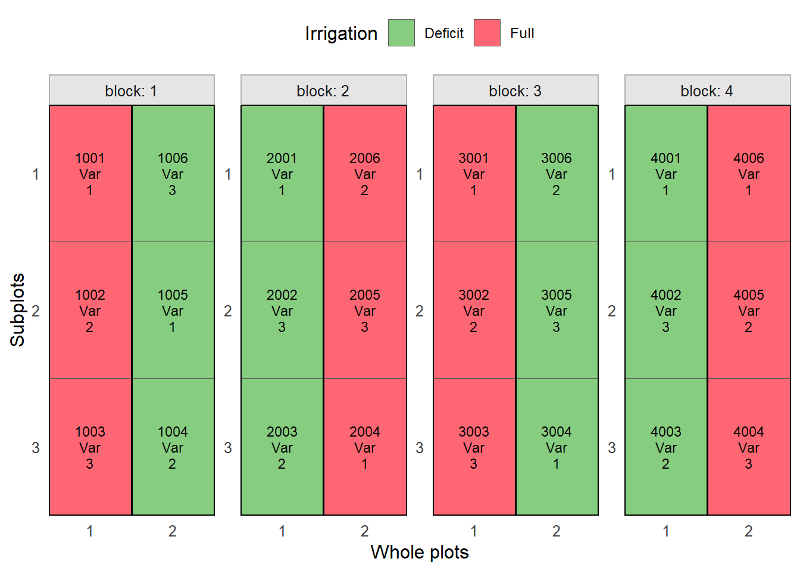
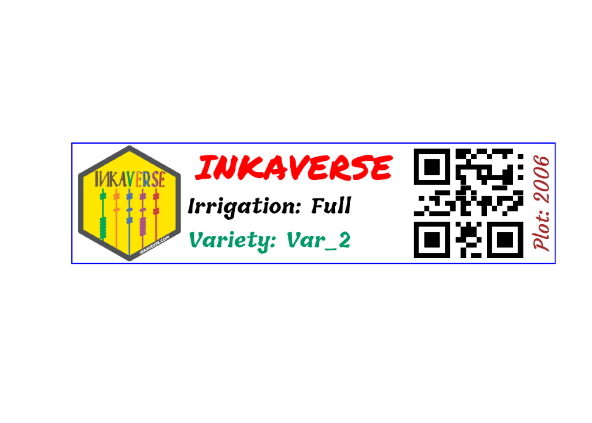

# Two-Factors Design: Split-Plot in RCBD

Planning an experiment follows a reproducible routine:

1.  **Load required libraries:** Load `inti`, `knitr`, and `dplyr`
    packages.
2.  **Define factor levels:** Set up lists with genotypes, treatments,
    and management factors.
3.  **Dispatch design generator:** Choose between CRD, RCBD, Split-plot,
    or Augmented designs.
4.  **Plot the field sketch:** Verify spatial layouts and
    serpentine/zigzag sequences.
5.  **Label design:** Design the experimental labels to facilitate the
    data collection.
6.  **Export to Field Book app:** Generate field-ready sheets with trait
    parameters.

\
`# Install packages and dependencies`\
\
[`library`](https://rdrr.io/r/base/library.html)`(`[`inti`](https://inkaverse.com/)`)`\
[`library`](https://rdrr.io/r/base/library.html)`(`[`dplyr`](https://dplyr.tidyverse.org)`)`\
[`library`](https://rdrr.io/r/base/library.html)`(`[`huito`](https://huito.inkaverse.com/)`)`

## Designs with Two Factors

When evaluating two or more factors, four designs become available:
**CRD**, **RCBD**, **Split-plot RCBD**, and **Augmented**.

### Split-Plot Design in RCBD

The Split-plot Design is recommended when one factor requires larger
experimental units due to management constraints (such as irrigation)
assigned to main plots, while a second factor (such as commercial quinoa
varieties) is assigned to sub-plots within each main plot.

\
`# 1. Define factors: Irrigation regimes (main plots) and commercial quinoa varieties (sub-plots)`\
`factors_split`` ``<-`` `[`list`](https://rdrr.io/r/base/list.html)`(`\
`  Irrigation ``=`` `[`c`](https://rdrr.io/r/base/c.html)`(``"Full"``, ``"Deficit"``)``,`\
`  Variety    ``=`` `[`c`](https://rdrr.io/r/base/c.html)`(``"Var_1"``, ``"Var_2"``, ``"Var_3"``)`\
`)`\
\
`# 2. Generate Split-plot layout: 2 main levels x 3 sub levels x 4 blocks = 24 plots`\
`split_exp`` ``<-`` `[`design_split`](https://inkaverse.com/reference/design_split.md)`(`\
`  factors ``=`` ``factors_split``,`\
`  type ``=`` ``"split_rcbd"``,`\
`  rep ``=`` ``4``,`\
`  zigzag ``=`` ``TRUE``,`\
`  seed ``=`` ``2026`\
`)`\
\
`# Fieldbook preview`\
`split_exp``$``fieldbook`` `[`%>%`](https://magrittr.tidyverse.org/reference/pipe.html)` `\
`  `[`head`](https://rdrr.io/r/utils/head.html)`(``10``)`` `[`%>%`](https://magrittr.tidyverse.org/reference/pipe.html)` `\
`  ``knitr``::`[`kable`](https://rdrr.io/pkg/knitr/man/kable.html)`(``caption ``=`` ``"Split-plot Fieldbook preview"``)`

| qrcode | plots | ntreat | Irrigation | Variety | wp_sp | block | sort | rows | cols | design |
|:---|---:|---:|:---|:---|:---|---:|---:|---:|---:|:---|
| inkaverse_1001_Full_Var_1 | 1001 | 1 | Full | Var_1 | Full_Var_1 | 1 | 1 | 1 | 1 | split-rcbd |
| inkaverse_1002_Full_Var_2 | 1002 | 3 | Full | Var_2 | Full_Var_2 | 1 | 2 | 2 | 1 | split-rcbd |
| inkaverse_1003_Full_Var_3 | 1003 | 5 | Full | Var_3 | Full_Var_3 | 1 | 3 | 3 | 1 | split-rcbd |
| inkaverse_1004_Deficit_Var_2 | 1004 | 4 | Deficit | Var_2 | Deficit_Var_2 | 1 | 4 | 3 | 2 | split-rcbd |
| inkaverse_1005_Deficit_Var_1 | 1005 | 2 | Deficit | Var_1 | Deficit_Var_1 | 1 | 5 | 2 | 2 | split-rcbd |
| inkaverse_1006_Deficit_Var_3 | 1006 | 6 | Deficit | Var_3 | Deficit_Var_3 | 1 | 6 | 1 | 2 | split-rcbd |
| inkaverse_2001_Deficit_Var_1 | 2001 | 2 | Deficit | Var_1 | Deficit_Var_1 | 2 | 1 | 4 | 1 | split-rcbd |
| inkaverse_2002_Deficit_Var_3 | 2002 | 6 | Deficit | Var_3 | Deficit_Var_3 | 2 | 2 | 5 | 1 | split-rcbd |
| inkaverse_2003_Deficit_Var_2 | 2003 | 4 | Deficit | Var_2 | Deficit_Var_2 | 2 | 3 | 6 | 1 | split-rcbd |
| inkaverse_2004_Full_Var_1 | 2004 | 1 | Full | Var_1 | Full_Var_1 | 2 | 4 | 6 | 2 | split-rcbd |

Split-plot Fieldbook preview {.table .caption-top}

\
\
`# Field layout visualization`\
[`tarpuy_plotdesign`](https://inkaverse.com/reference/tarpuy_plotdesign.md)`(`\
`  data ``=`` ``split_exp``,`\
`  factor ``=`` ``"Irrigation"``,`\
`  fill ``=`` `[`c`](https://rdrr.io/r/base/c.html)`(``"plots"``, ``"Variety"``)`\
`)`

## Label

The experimental field book generated by the design is used as the input
data for label creation. Each row represents an experimental unit,
allowing the automatic generation of individualized labels.

\
`# Experimental fieldbook`\
`fb`` ``<-`` ``split_exp``$``fieldbook`

## Customize the label layout

The label layout can be customized by combining text, images and QR
codes. Each layer can use values from the experimental field book,
allowing automatic generation of labels for every experimental plot.

Load package and import fonts.

\
`font`` ``<-`` `[`c`](https://rdrr.io/r/base/c.html)`(``"Permanent Marker"``, ``"Tillana"``, ``"Courgette"``)`\
\
[`huito_fonts`](http://huito.inkaverse.com/reference/huito_fonts.md)`(``font``)`

> You can find more fonts in <https://fonts.google.com/>

## Label design

\
`label`` ``<-`` ``fb`` `[`%>%`](https://magrittr.tidyverse.org/reference/pipe.html)`  `\
`  `[`label_layout`](http://huito.inkaverse.com/reference/label_layout.md)`(``size ``=`` `[`c`](https://rdrr.io/r/base/c.html)`(``10``, ``2.5``)`\
`               , border_color ``=`` ``"blue"`\
`               ``)`` `[`%>%`](https://magrittr.tidyverse.org/reference/pipe.html)\
`  `[`include_image`](http://huito.inkaverse.com/reference/include_image.md)`(`\
`    value ``=`` ``"https://flavjack.github.io/inti/img/inkaverse.png"`\
`    , size ``=`` `[`c`](https://rdrr.io/r/base/c.html)`(``2.1``, ``2.4``)`\
`    , position ``=`` `[`c`](https://rdrr.io/r/base/c.html)`(``1.2``, ``1.25``)`\
`    ``# , opts = list("image_scale(200)", "image_noise()")`\
`    ``)`` `[`%>%`](https://magrittr.tidyverse.org/reference/pipe.html)\
`  `[`include_barcode`](http://huito.inkaverse.com/reference/include_barcode.md)`(`\
`     value ``=`` ``"barcode"`\
`     , size ``=`` `[`c`](https://rdrr.io/r/base/c.html)`(``2.5``, ``2.5``)`\
`     , position ``=`` `[`c`](https://rdrr.io/r/base/c.html)`(``8.2``, ``1.25``)`\
`     ``)`` `[`%>%`](https://magrittr.tidyverse.org/reference/pipe.html)\
`  `[`include_text`](http://huito.inkaverse.com/reference/include_text.md)`(``value ``=`` ``"INKAVERSE"`\
`               , position ``=`` `[`c`](https://rdrr.io/r/base/c.html)`(``4.6``, ``2``)`\
`               , size ``=`` ``20`\
`               , font ``=`` ``font``[``1``]`\
`               , fontface ``=`` ``"bold"`\
`               , color ``=`` ``"red"`\
`               ``)`` `[`%>%`](https://magrittr.tidyverse.org/reference/pipe.html)\
`  `[`include_text`](http://huito.inkaverse.com/reference/include_text.md)`(``value ``=`` ``"Irrigation"`\
`               , position ``=`` `[`c`](https://rdrr.io/r/base/c.html)`(``2.4``, ``1.2``)`\
`               , size ``=`` ``12`\
`               , opts ``=`` `[`list`](https://rdrr.io/r/base/list.html)`(``hjust ``=`` ``0.0``, vjust ``=`` ``0.0``)`\
`               , font ``=`` ``font``[``2``]`\
`               , color ``=`` ``"black"`\
`               , prefix ``=`` ``"Irrigation: "`\
`               , fontface ``=`` ``"bold"`\
`               ``)`` `[`%>%`](https://magrittr.tidyverse.org/reference/pipe.html)\
`    `[`include_text`](http://huito.inkaverse.com/reference/include_text.md)`(``value ``=`` ``"Variety"`\
`               , position ``=`` `[`c`](https://rdrr.io/r/base/c.html)`(``2.4``, ``0.5``)`\
`               , opts ``=`` `[`list`](https://rdrr.io/r/base/list.html)`(``hjust ``=`` ``0.0``, vjust ``=`` ``0.0``)`` `\
`               , size ``=`` ``12`\
`               , color ``=`` ``"#009966"`\
`               , font ``=`` ``font``[``2``]`\
`               , prefix ``=`` ``"Variety: "`\
`               , fontface ``=`` ``"bold"`\
`               ``)`` `[`%>%`](https://magrittr.tidyverse.org/reference/pipe.html)` `\
`  `[`include_text`](http://huito.inkaverse.com/reference/include_text.md)`(``value ``=`` ``"plots"`\
`               , position ``=`` `[`c`](https://rdrr.io/r/base/c.html)`(``9.7``, ``1.25``)`\
`               , angle ``=`` ``90`\
`               , size ``=`` ``12`\
`               , color ``=`` ``"brown"`\
`               , font ``=`` ``font``[``3``]`\
`               , prefix ``=`` ``"Plot: "`\
`               ``)`` `

### Label preview

The preview mode `label_print(mode = "preview")` generate a example of
the label design from a random row of the data set.

### Generate the complete labels

If you want generate the complete labels list, change:
`label_print(mode = "complete")`.

\
`label`` `[`%>%`](https://magrittr.tidyverse.org/reference/pipe.html)` `\
`  `[`label_print`](http://huito.inkaverse.com/reference/label_print.md)`(``mode ``=`` ``"complete"`\
`              , filename ``=`` ``"horizontal-split"`\
`              , nlabels ``=`` ``12``)`
