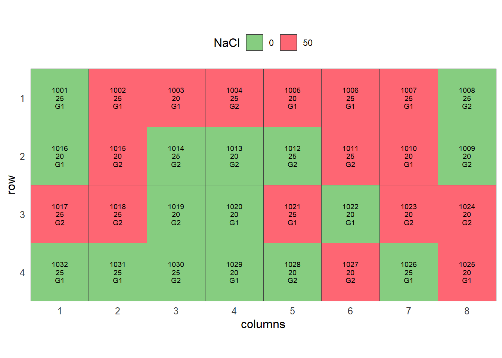
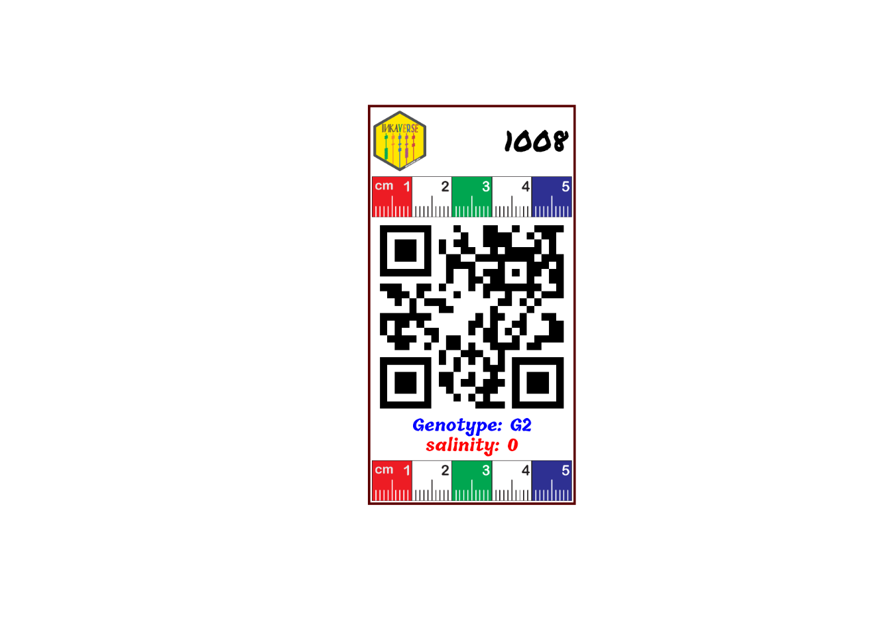

# Three-Factors Design: CRD

Planning an experiment follows a reproducible routine:

1.  **Load required libraries:** Load `inti`, `knitr`, and `dplyr`
    packages.
2.  **Define factor levels:** Set up lists with genotypes, treatments,
    and management factors.
3.  **Dispatch design generator:** Choose between CRD, RCBD, Split-plot,
    or Augmented designs.
4.  **Plot the field sketch:** Verify spatial layouts and
    serpentine/zigzag sequences.
5.  **Label design:** Design the experimental labels to facilitate the
    data collection.
6.  **Export to Field Book app:** Generate field-ready sheets with trait
    parameters.

``` r

# Install packages and dependencies

library(inti)
library(tidyverse)
library(huito)
```

## Designs with Three Factors

When evaluating three factors, factorial experiments can be implemented
using **CRD** and **RCBD** designs.

## Factorial Completely Randomized Design (Factorial CRD)

Recommended for multi-factor experiments under homogeneous conditions,
such as temperature-, salinity-, and genotype-controlled germination
assays in growth chambers.

``` r

# 1. Define factors: Salinity levels, incubation temperatures, and genotypes
factors_crd_3f <- list(
  NaCl = c("0", "50"),
  Temp = c("20", "25"),
  Genotype = c("G1", "G2")
)

# 2. Generate factorial CRD layout
crd_exp_3f <- design_repblock(
  nfactors = 3,
  factors = factors_crd_3f,
  type = "crd",
  rep = 4,
  zigzag = TRUE,
  seed = 2026
)

# Fieldbook preview
crd_exp_3f$fieldbook %>%
  head(10) %>%
  knitr::kable(caption = "Factorial CRD Fieldbook preview")
```

| qrcode         | plots | ntreat | NaCl | Temp | Genotype | sort | rep | rows | cols | design |
|:---------------|------:|-------:|:-----|:-----|:---------|-----:|----:|-----:|-----:|:-------|
| inkaverse_1001 |  1001 |      3 | 0    | 25   | G1       |    1 |   1 |    1 |    1 | crd    |
| inkaverse_1002 |  1002 |      4 | 50   | 25   | G1       |    2 |   2 |    1 |    2 | crd    |
| inkaverse_1003 |  1003 |      2 | 50   | 20   | G1       |    3 |   4 |    1 |    3 | crd    |
| inkaverse_1004 |  1004 |      8 | 50   | 25   | G2       |    4 |   1 |    1 |    4 | crd    |
| inkaverse_1005 |  1005 |      2 | 50   | 20   | G1       |    5 |   2 |    1 |    5 | crd    |
| inkaverse_1006 |  1006 |      4 | 50   | 25   | G1       |    6 |   1 |    1 |    6 | crd    |
| inkaverse_1007 |  1007 |      4 | 50   | 25   | G1       |    7 |   4 |    1 |    7 | crd    |
| inkaverse_1008 |  1008 |      7 | 0    | 25   | G2       |    8 |   3 |    1 |    8 | crd    |
| inkaverse_1009 |  1009 |      5 | 0    | 20   | G2       |    9 |   4 |    2 |    8 | crd    |
| inkaverse_1010 |  1010 |      2 | 50   | 20   | G1       |   10 |   3 |    2 |    7 | crd    |

Factorial CRD Fieldbook preview {.table .caption-top}

``` r


# Spatial layout visualization
tarpuy_plotdesign(
  data = crd_exp_3f,
  factor = "NaCl",
  fill = c("plots", "Temp", "Genotype")
)
```



## Label

The experimental field book generated by the design is used as the input
data for label creation. Each row represents an experimental unit,
allowing the automatic generation of individualized labels.

``` r

# Experimental fieldbook
fb <- crd_exp_3f$fieldbook
```

## Customize the label layout

The label layout can be customized by combining text, images and QR
codes. Each layer can use values from the experimental field book,
allowing automatic generation of labels for every experimental plot.

Load package and import fonts.

``` r

font <- c("Permanent Marker", "Tillana", "Courgette")

huito_fonts(font)
```

> You can find more fonts in <https://fonts.google.com/>

## Label design

### Label preview

The preview mode `label_print(mode = "preview")` generate a example of
the label design from a random row of the data set.



### Generate the complete labels

If you want generate the complete labels list, change:
`label_print(mode = "complete")`.

``` r

label %>% 
  label_print(mode = "complete"
              , filename = "vertical-DCA-3"
              , nlabels = 12)
```
