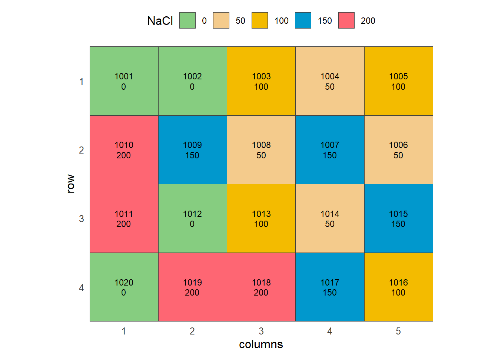
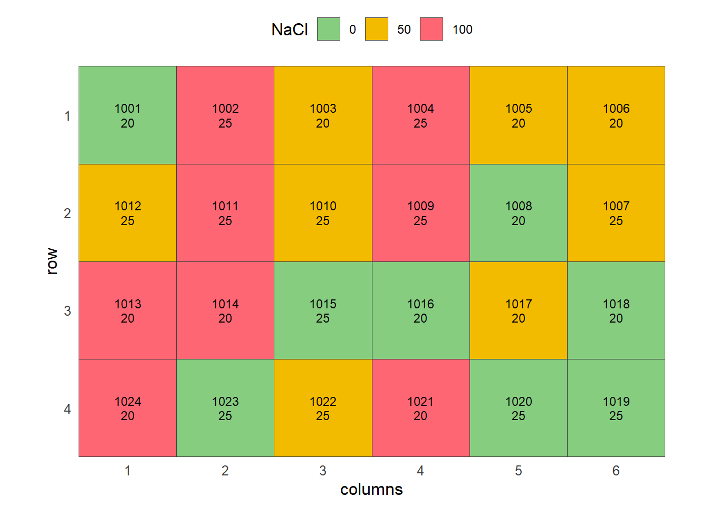
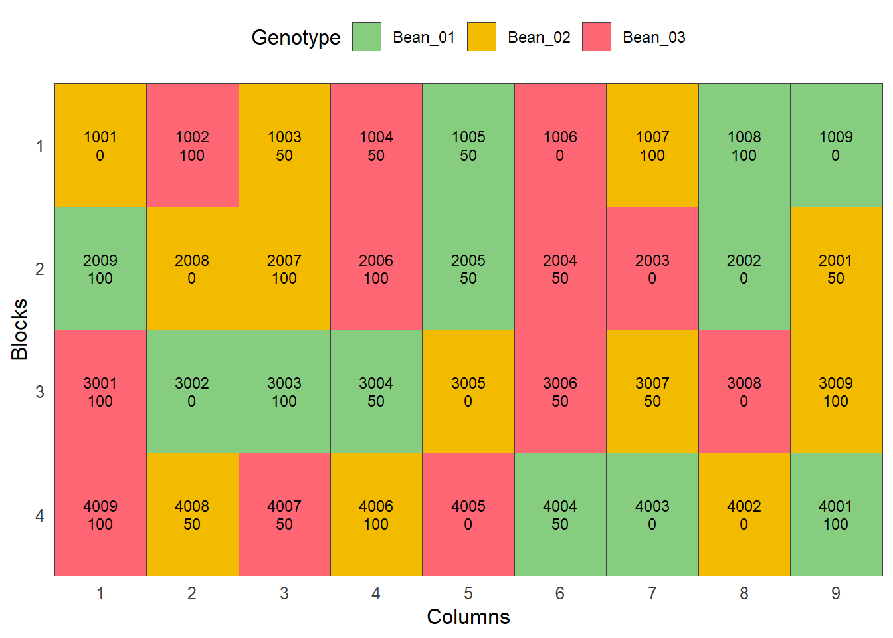
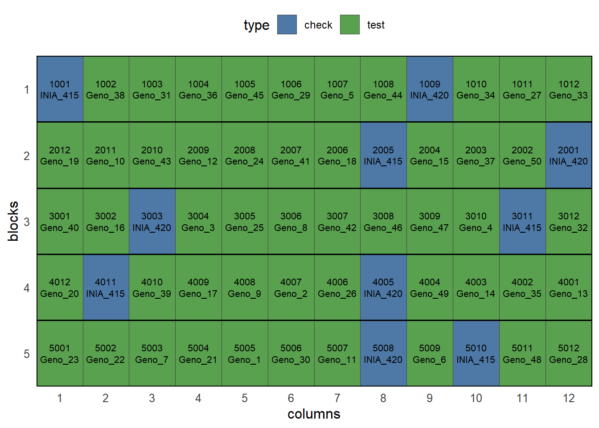

# Experimental Designs

inti is part of the inkaverse project for developing procedures and
tools used in plant science and experimental designs. The TARPUY module
allows researchers to plan, randomize, generate fieldbooks, and
visualize experimental design layouts either through R code or via an
interactive Shiny add-in (inti::tarpuy()).

inti

Project

Planning an experiment follows a reproducible routine:

1.  **Load required libraries:** Load `inti`, `knitr`, and `dplyr`
    packages.
2.  **Define factor levels:** Set up lists with genotypes, treatments,
    and management factors.
3.  **Dispatch design generator:** Choose between CRD, RCBD, Split-plot,
    or Augmented designs.
4.  **Plot the field sketch:** Verify spatial layouts and
    serpentine/zigzag sequences.
5.  **Export to Field Book app:** Generate field-ready sheets with trait
    parameters.

\
`# Install packages and dependencies`\
\
[`library`](https://rdrr.io/r/base/library.html)`(`[`inti`](https://inkaverse.com/)`)`\
[`library`](https://rdrr.io/r/base/library.html)`(`[`knitr`](https://yihui.org/knitr/)`)`\
[`library`](https://rdrr.io/r/base/library.html)`(`[`dplyr`](https://dplyr.tidyverse.org)`)`

## Single-Factor Designs

Only **CRD** and **RCBD** support a single experimental factor.

### Completely Randomized Design (CRD)

The Completely Randomized Design is recommended when experimental units
are homogeneous, such as germination chambers, lab assays, or controlled
greenhouse benches.

\
`# 1. Define salinity levels (NaCl concentrations in mM)`\
`factors_crd`` ``<-`` `[`list`](https://rdrr.io/r/base/list.html)`(`\
`  NaCl``=`` `[`c`](https://rdrr.io/r/base/c.html)`(``"0"``, ``"50"``, ``"100"``, ``"150"``, ``"200"``)`\
`)`\
\
`# 2. Generate CRD layout (5 treatments x 4 replications = 20 petri dishes/units)`\
`crd_exp`` ``<-`` `[`design_repblock`](https://inkaverse.com/reference/design_repblock.md)`(`\
`  factors ``=`` ``factors_crd``,`\
`  type ``=`` ``"crd"``,`\
`  rep ``=`` ``4``,`\
`  zigzag ``=`` ``TRUE``,`\
`  seed ``=`` ``2026`\
`)`\
\
`# Fieldbook preview`\
`crd_exp``$``fieldbook`` `[`%>%`](https://magrittr.tidyverse.org/reference/pipe.html)` `\
`  `[`head`](https://rdrr.io/r/utils/head.html)`(``10``)`` `[`%>%`](https://magrittr.tidyverse.org/reference/pipe.html)` `\
`  ``knitr``::`[`kable`](https://rdrr.io/pkg/knitr/man/kable.html)`(``caption ``=`` ``"CRD Fieldbook preview"``)`

| qrcode         | plots | ntreat | NaCl | sort | rep | rows | cols | design |
|:---------------|------:|-------:|:-----|-----:|----:|-----:|-----:|:-------|
| inkaverse_1001 |  1001 |      1 | 0    |    1 |   1 |    1 |    1 | crd    |
| inkaverse_1002 |  1002 |      1 | 0    |    2 |   3 |    1 |    2 | crd    |
| inkaverse_1003 |  1003 |      3 | 100  |    3 |   3 |    1 |    3 | crd    |
| inkaverse_1004 |  1004 |      2 | 50   |    4 |   2 |    1 |    4 | crd    |
| inkaverse_1005 |  1005 |      3 | 100  |    5 |   2 |    1 |    5 | crd    |
| inkaverse_1006 |  1006 |      2 | 50   |    6 |   1 |    2 |    5 | crd    |
| inkaverse_1007 |  1007 |      4 | 150  |    7 |   3 |    2 |    4 | crd    |
| inkaverse_1008 |  1008 |      2 | 50   |    8 |   3 |    2 |    3 | crd    |
| inkaverse_1009 |  1009 |      4 | 150  |    9 |   4 |    2 |    2 | crd    |
| inkaverse_1010 |  1010 |      5 | 200  |   10 |   2 |    2 |    1 | crd    |

CRD Fieldbook preview {.table .caption-top}

\
\
`# Layout on germination chamber shelves`\
\
[`tarpuy_plotdesign`](https://inkaverse.com/reference/tarpuy_plotdesign.md)`(`\
`  data ``=`` ``crd_exp``,`\
`  factor ``=`` ``"NaCl"``,`\
`  fill ``=`` `[`c`](https://rdrr.io/r/base/c.html)`(``"plots"``, ``"NaCl"``)`\
`)`

### Randomized Complete Block Design (RCBD)

The Randomized Complete Block Design is recommended when an
environmental gradient is present in the field, grouping experimental
units into homogeneous blocks to control spatial variability.

\
`# 1. Define factors: Bean genotypes and fertilization doses`\
`factors_rcbd`` ``<-`` `[`list`](https://rdrr.io/r/base/list.html)`(`\
`  Genotype ``=`` `[`c`](https://rdrr.io/r/base/c.html)`(``"Bean_01"``, ``"Bean_02"``, ``"Bean_03"``)``,`\
`  Fertilization ``=`` `[`c`](https://rdrr.io/r/base/c.html)`(``"0"``, ``"50"``, ``"100"``)`\
`)`\
\
`# 2. Generate RCBD layout (3 genotypes x 3 doses = 9 treatments, 4 blocks = 36 )`\
`rcbd_exp`` ``<-`` `[`design_repblock`](https://inkaverse.com/reference/design_repblock.md)`(`\
`  nfactors ``=`` ``2``,`\
`  factors ``=`` ``factors_rcbd``,`\
`  type ``=`` ``"rcbd"``,`\
`  rep ``=`` ``4``,`\
`  zigzag ``=`` ``TRUE``,`\
`  seed ``=`` ``2026`\
`)`\
\
`# Fieldbook preview`\
`rcbd_exp``$``fieldbook`` `[`%>%`](https://magrittr.tidyverse.org/reference/pipe.html)` `\
`  `[`head`](https://rdrr.io/r/utils/head.html)`(``10``)`` `[`%>%`](https://magrittr.tidyverse.org/reference/pipe.html)` `\
`  ``knitr``::`[`kable`](https://rdrr.io/pkg/knitr/man/kable.html)`(``caption ``=`` ``"RCBD Fieldbook preview"``)`

| qrcode         | plots | ntreat | Genotype | Fertilization | sort | block | rows | cols | design |
|:---------------|------:|-------:|:---------|:--------------|-----:|------:|-----:|-----:|:-------|
| inkaverse_1001 |  1001 |      2 | Bean_02  | 0             |    1 |     1 |    1 |    1 | rcbd   |
| inkaverse_1002 |  1002 |      9 | Bean_03  | 100           |    2 |     1 |    1 |    2 | rcbd   |
| inkaverse_1003 |  1003 |      5 | Bean_02  | 50            |    3 |     1 |    1 |    3 | rcbd   |
| inkaverse_1004 |  1004 |      6 | Bean_03  | 50            |    4 |     1 |    1 |    4 | rcbd   |
| inkaverse_1005 |  1005 |      4 | Bean_01  | 50            |    5 |     1 |    1 |    5 | rcbd   |
| inkaverse_1006 |  1006 |      3 | Bean_03  | 0             |    6 |     1 |    1 |    6 | rcbd   |
| inkaverse_1007 |  1007 |      8 | Bean_02  | 100           |    7 |     1 |    1 |    7 | rcbd   |
| inkaverse_1008 |  1008 |      7 | Bean_01  | 100           |    8 |     1 |    1 |    8 | rcbd   |
| inkaverse_1009 |  1009 |      1 | Bean_01  | 0             |    9 |     1 |    1 |    9 | rcbd   |
| inkaverse_2001 |  2001 |      5 | Bean_02  | 50            |    1 |     2 |    2 |    9 | rcbd   |

RCBD Fieldbook preview {.table .caption-top}

\
\
`# Field layout visualization`\
[`tarpuy_plotdesign`](https://inkaverse.com/reference/tarpuy_plotdesign.md)`(`\
`  data ``=`` ``rcbd_exp``,`\
`  factor ``=`` ``"Genotype"``,`\
`  fill ``=`` `[`c`](https://rdrr.io/r/base/c.html)`(``"plots"``, ``"Fertilization"``)`\
`)`

## Designs with Two or More Factors

When evaluating two or more factors, all four designs become available:
**CRD**, **RCBD**, **Split-plot RCBD**, and **Augmented**.

### Completely Randomized Design (Factorial CRD)

Recommended for multi-factor experiments under homogeneous conditions,
such as temperature- and salinity-controlled germination assays in
growth chambers.

\
`# 1. Define factors: Salinity levels and incubation temperatures`\
`factors_crd_2f`` ``<-`` `[`list`](https://rdrr.io/r/base/list.html)`(`\
`  NaCl ``=`` `[`c`](https://rdrr.io/r/base/c.html)`(``"0"``, ``"50"``, ``"100"``)``,`\
`  Temp ``=`` `[`c`](https://rdrr.io/r/base/c.html)`(``"20"``, ``"25"``)`\
`)`\
\
`# 2. Generate factorial CRD layout`\
`crd_exp_2f`` ``<-`` `[`design_repblock`](https://inkaverse.com/reference/design_repblock.md)`(`\
`  nfactors ``=`` ``2``,`\
`  factors ``=`` ``factors_crd_2f``,`\
`  type ``=`` ``"crd"``,`\
`  rep ``=`` ``4``,`\
`  zigzag ``=`` ``TRUE``,`\
`  seed ``=`` ``2026`\
`)`\
\
`# Fieldbook preview`\
`crd_exp_2f``$``fieldbook`` `[`%>%`](https://magrittr.tidyverse.org/reference/pipe.html)\
`  `[`head`](https://rdrr.io/r/utils/head.html)`(``10``)`` `[`%>%`](https://magrittr.tidyverse.org/reference/pipe.html)\
`  ``knitr``::`[`kable`](https://rdrr.io/pkg/knitr/man/kable.html)`(``caption ``=`` ``"Factorial CRD Fieldbook preview"``)`

| qrcode         | plots | ntreat | NaCl | Temp | sort | rep | rows | cols | design |
|:---------------|------:|-------:|:-----|:-----|-----:|----:|-----:|-----:|:-------|
| inkaverse_1001 |  1001 |      1 | 0    | 20   |    1 |   1 |    1 |    1 | crd    |
| inkaverse_1002 |  1002 |      6 | 100  | 25   |    2 |   2 |    1 |    2 | crd    |
| inkaverse_1003 |  1003 |      2 | 50   | 20   |    3 |   3 |    1 |    3 | crd    |
| inkaverse_1004 |  1004 |      6 | 100  | 25   |    4 |   1 |    1 |    4 | crd    |
| inkaverse_1005 |  1005 |      2 | 50   | 20   |    5 |   2 |    1 |    5 | crd    |
| inkaverse_1006 |  1006 |      2 | 50   | 20   |    6 |   1 |    1 |    6 | crd    |
| inkaverse_1007 |  1007 |      5 | 50   | 25   |    7 |   4 |    2 |    6 | crd    |
| inkaverse_1008 |  1008 |      1 | 0    | 20   |    8 |   3 |    2 |    5 | crd    |
| inkaverse_1009 |  1009 |      6 | 100  | 25   |    9 |   3 |    2 |    4 | crd    |
| inkaverse_1010 |  1010 |      5 | 50   | 25   |   10 |   2 |    2 |    3 | crd    |

Factorial CRD Fieldbook preview {.table .caption-top}

\
\
`# Spatial layout visualization`\
[`tarpuy_plotdesign`](https://inkaverse.com/reference/tarpuy_plotdesign.md)`(`\
`  data ``=`` ``crd_exp_2f``,`\
`  factor ``=`` ``"NaCl"``,`\
`  fill ``=`` `[`c`](https://rdrr.io/r/base/c.html)`(``"plots"``, ``"Temp"``)`\
`)`

### Randomized Complete Block Design (Factorial RCBD)

Recommended for multi-factor trials where field spatial variability or
environmental gradients require blocking to control experimental error.

\
`# 1. Define factors: Bean genotypes and fertilization levels`\
`factors_rcbd`` ``<-`` `[`list`](https://rdrr.io/r/base/list.html)`(`\
`  Genotype ``=`` `[`c`](https://rdrr.io/r/base/c.html)`(``"Bean_01"``, ``"Bean_02"``, ``"Bean_03"``)``,`\
`  Fertilization ``=`` `[`c`](https://rdrr.io/r/base/c.html)`(``"0"``, ``"50"``, ``"100"``)`\
`)`\
\
`# 2. Generate factorial RCBD layout`\
`rcbd_exp`` ``<-`` `[`design_repblock`](https://inkaverse.com/reference/design_repblock.md)`(`\
`  nfactors ``=`` ``2``,`\
`  factors ``=`` ``factors_rcbd``,`\
`  type ``=`` ``"rcbd"``,`\
`  rep ``=`` ``4``,`\
`  zigzag ``=`` ``TRUE``,`\
`  seed ``=`` ``2026`\
`)`\
\
`# Fieldbook preview`\
`rcbd_exp``$``fieldbook`` `[`%>%`](https://magrittr.tidyverse.org/reference/pipe.html)\
`  `[`head`](https://rdrr.io/r/utils/head.html)`(``10``)`` `[`%>%`](https://magrittr.tidyverse.org/reference/pipe.html)\
`  ``knitr``::`[`kable`](https://rdrr.io/pkg/knitr/man/kable.html)`(``caption ``=`` ``"Factorial RCBD Fieldbook preview"``)`

| qrcode         | plots | ntreat | Genotype | Fertilization | sort | block | rows | cols | design |
|:---------------|------:|-------:|:---------|:--------------|-----:|------:|-----:|-----:|:-------|
| inkaverse_1001 |  1001 |      2 | Bean_02  | 0             |    1 |     1 |    1 |    1 | rcbd   |
| inkaverse_1002 |  1002 |      9 | Bean_03  | 100           |    2 |     1 |    1 |    2 | rcbd   |
| inkaverse_1003 |  1003 |      5 | Bean_02  | 50            |    3 |     1 |    1 |    3 | rcbd   |
| inkaverse_1004 |  1004 |      6 | Bean_03  | 50            |    4 |     1 |    1 |    4 | rcbd   |
| inkaverse_1005 |  1005 |      4 | Bean_01  | 50            |    5 |     1 |    1 |    5 | rcbd   |
| inkaverse_1006 |  1006 |      3 | Bean_03  | 0             |    6 |     1 |    1 |    6 | rcbd   |
| inkaverse_1007 |  1007 |      8 | Bean_02  | 100           |    7 |     1 |    1 |    7 | rcbd   |
| inkaverse_1008 |  1008 |      7 | Bean_01  | 100           |    8 |     1 |    1 |    8 | rcbd   |
| inkaverse_1009 |  1009 |      1 | Bean_01  | 0             |    9 |     1 |    1 |    9 | rcbd   |
| inkaverse_2001 |  2001 |      5 | Bean_02  | 50            |    1 |     2 |    2 |    9 | rcbd   |

Factorial RCBD Fieldbook preview {.table .caption-top}

\
\
`# Spatial layout visualization`\
[`tarpuy_plotdesign`](https://inkaverse.com/reference/tarpuy_plotdesign.md)`(`\
`  data ``=`` ``rcbd_exp``,`\
`  factor ``=`` ``"Genotype"``,`\
`  fill ``=`` `[`c`](https://rdrr.io/r/base/c.html)`(``"plots"``, ``"Fertilization"``)`\
`)`

### Split-plot Design (Split-RCBD)

The Split-plot Design is recommended when one factor requires larger
experimental units due to management constraints (such as irrigation)
assigned to main plots, while a second factor (such as commercial quinoa
varieties) is assigned to sub-plots within each main plot.

\
`# 1. Define factors: Irrigation regimes (main plots) and commercial quinoa varieties (sub-plots)`\
`factors_split`` ``<-`` `[`list`](https://rdrr.io/r/base/list.html)`(`\
`  Irrigation ``=`` `[`c`](https://rdrr.io/r/base/c.html)`(``"Full"``, ``"Deficit"``)``,`\
`  Variety    ``=`` `[`c`](https://rdrr.io/r/base/c.html)`(``"Var_1"``, ``"Var_2"``, ``"Var_3"``)`\
`)`\
\
`# 2. Generate Split-plot layout: 2 main levels x 3 sub levels x 4 blocks = 24 plots`\
`split_exp`` ``<-`` `[`design_split`](https://inkaverse.com/reference/design_split.md)`(`\
`  factors ``=`` ``factors_split``,`\
`  type ``=`` ``"split_rcbd"``,`\
`  rep ``=`` ``4``,`\
`  zigzag ``=`` ``TRUE``,`\
`  seed ``=`` ``2026`\
`)`\
\
`# Fieldbook preview`\
`split_exp``$``fieldbook`` `[`%>%`](https://magrittr.tidyverse.org/reference/pipe.html)` `\
`  `[`head`](https://rdrr.io/r/utils/head.html)`(``10``)`` `[`%>%`](https://magrittr.tidyverse.org/reference/pipe.html)` `\
`  ``knitr``::`[`kable`](https://rdrr.io/pkg/knitr/man/kable.html)`(``caption ``=`` ``"Split-plot Fieldbook preview"``)`

| qrcode | plots | ntreat | Irrigation | Variety | wp_sp | block | sort | rows | cols | design |
|:---|---:|---:|:---|:---|:---|---:|---:|---:|---:|:---|
| inkaverse_1001_Full_Var_1 | 1001 | 1 | Full | Var_1 | Full_Var_1 | 1 | 1 | 1 | 1 | split-rcbd |
| inkaverse_1002_Full_Var_2 | 1002 | 3 | Full | Var_2 | Full_Var_2 | 1 | 2 | 2 | 1 | split-rcbd |
| inkaverse_1003_Full_Var_3 | 1003 | 5 | Full | Var_3 | Full_Var_3 | 1 | 3 | 3 | 1 | split-rcbd |
| inkaverse_1004_Deficit_Var_2 | 1004 | 4 | Deficit | Var_2 | Deficit_Var_2 | 1 | 4 | 3 | 2 | split-rcbd |
| inkaverse_1005_Deficit_Var_1 | 1005 | 2 | Deficit | Var_1 | Deficit_Var_1 | 1 | 5 | 2 | 2 | split-rcbd |
| inkaverse_1006_Deficit_Var_3 | 1006 | 6 | Deficit | Var_3 | Deficit_Var_3 | 1 | 6 | 1 | 2 | split-rcbd |
| inkaverse_2001_Deficit_Var_1 | 2001 | 2 | Deficit | Var_1 | Deficit_Var_1 | 2 | 1 | 4 | 1 | split-rcbd |
| inkaverse_2002_Deficit_Var_3 | 2002 | 6 | Deficit | Var_3 | Deficit_Var_3 | 2 | 2 | 5 | 1 | split-rcbd |
| inkaverse_2003_Deficit_Var_2 | 2003 | 4 | Deficit | Var_2 | Deficit_Var_2 | 2 | 3 | 6 | 1 | split-rcbd |
| inkaverse_2004_Full_Var_1 | 2004 | 1 | Full | Var_1 | Full_Var_1 | 2 | 4 | 6 | 2 | split-rcbd |

Split-plot Fieldbook preview {.table .caption-top}

\
\
`# Field layout visualization`\
[`tarpuy_plotdesign`](https://inkaverse.com/reference/tarpuy_plotdesign.md)`(`\
`  data ``=`` ``split_exp``,`\
`  factor ``=`` ``"Irrigation"``,`\
`  fill ``=`` `[`c`](https://rdrr.io/r/base/c.html)`(``"plots"``, ``"Variety"``)`\
`)`

### Augmented Randomized Complete Block Design (Augmented RCBD)

The Augmented Design is recommended for screening large collections of
entries (e.g., accessions or candidate clones) when seed or space is
limited, repeating check varieties in each block while evaluating new
entries only once.

\
`# 1. Define checks (commercial controls) and new accessions`\
`checks`` ``<-`` `[`c`](https://rdrr.io/r/base/c.html)`(``"INIA_415"``, ``"INIA_420"``)`\
`entries`` ``<-`` `[`paste0`](https://rdrr.io/r/base/paste.html)`(``"Geno_"``, ``1``:``50``)`\
\
`# 2. Generate Augmented layout: 18 entries + (2 checks x 3 blocks) = 24 plots`\
`aug_exp`` ``<-`` `[`design_augmented`](https://inkaverse.com/reference/design_augmented.md)`(`\
`  checks ``=`` ``checks``,`\
`  entries ``=`` ``entries``,`\
`  blocks ``=`` ``5``,`\
`  zigzag ``=`` ``TRUE``,`\
`  seed ``=`` ``2026`\
`)`\
\
`# Fieldbook preview`\
`aug_exp``$``fieldbook`` `[`%>%`](https://magrittr.tidyverse.org/reference/pipe.html)` `\
`  `[`head`](https://rdrr.io/r/utils/head.html)`(``10``)`` `[`%>%`](https://magrittr.tidyverse.org/reference/pipe.html)` `\
`  ``knitr``::`[`kable`](https://rdrr.io/pkg/knitr/man/kable.html)`(``caption ``=`` ``"Augmented RCBD Fieldbook preview"``)`

| qrcode | plots | ntreat | entry | type | checks | block | sort | rows | cols | design |
|:---|---:|---:|:---|:---|---:|---:|---:|---:|---:|:---|
| inkaverse_1001_INIA_415 | 1001 | 1 | INIA_415 | check | 1 | 1 | 1 | 1 | 1 | augmented |
| inkaverse_1002_Geno_38 | 1002 | 40 | Geno_38 | test | 0 | 1 | 2 | 1 | 2 | augmented |
| inkaverse_1003_Geno_31 | 1003 | 33 | Geno_31 | test | 0 | 1 | 3 | 1 | 3 | augmented |
| inkaverse_1004_Geno_36 | 1004 | 38 | Geno_36 | test | 0 | 1 | 4 | 1 | 4 | augmented |
| inkaverse_1005_Geno_45 | 1005 | 47 | Geno_45 | test | 0 | 1 | 5 | 1 | 5 | augmented |
| inkaverse_1006_Geno_29 | 1006 | 31 | Geno_29 | test | 0 | 1 | 6 | 1 | 6 | augmented |
| inkaverse_1007_Geno_5 | 1007 | 7 | Geno_5 | test | 0 | 1 | 7 | 1 | 7 | augmented |
| inkaverse_1008_Geno_44 | 1008 | 46 | Geno_44 | test | 0 | 1 | 8 | 1 | 8 | augmented |
| inkaverse_1009_INIA_420 | 1009 | 2 | INIA_420 | check | 1 | 1 | 9 | 1 | 9 | augmented |
| inkaverse_1010_Geno_34 | 1010 | 36 | Geno_34 | test | 0 | 1 | 10 | 1 | 10 | augmented |

Augmented RCBD Fieldbook preview {.table .caption-top}

\
\
`# Field layout visualization`\
[`tarpuy_plotdesign`](https://inkaverse.com/reference/tarpuy_plotdesign.md)`(`\
`  data ``=`` ``aug_exp``,`\
`  factor ``=`` ``"type"``,          `\
`  fill ``=`` `[`c`](https://rdrr.io/r/base/c.html)`(``"plots"``, ``"entry"``)`\
`)`

