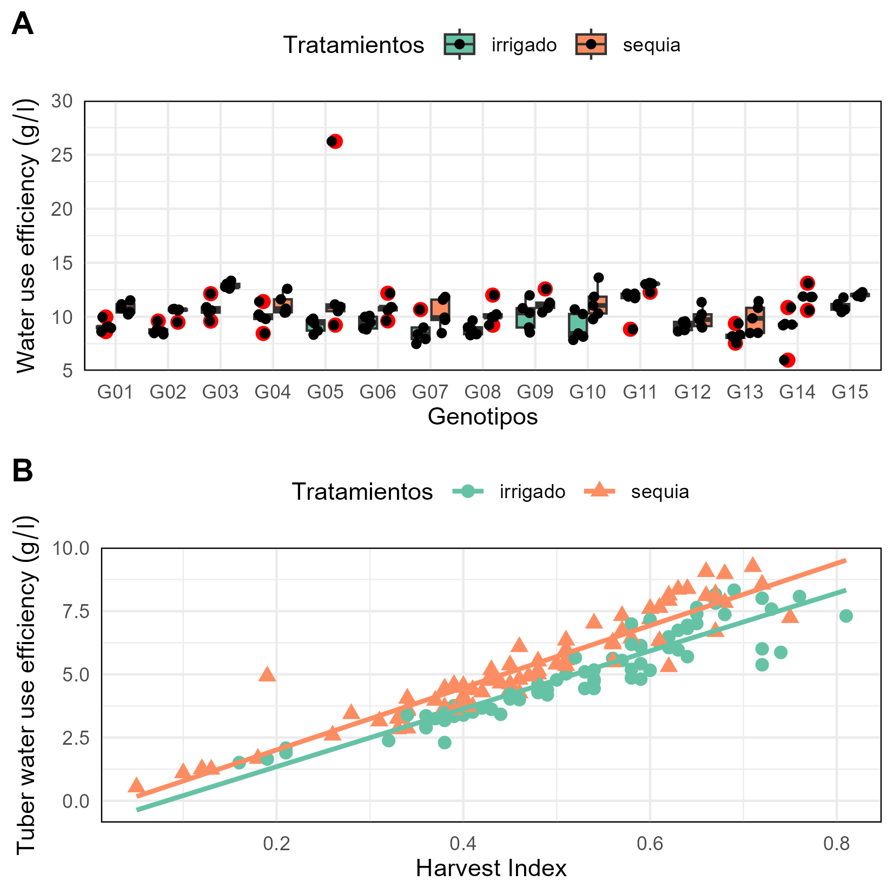
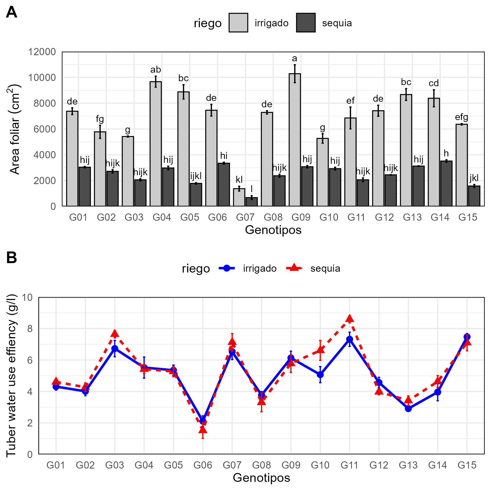
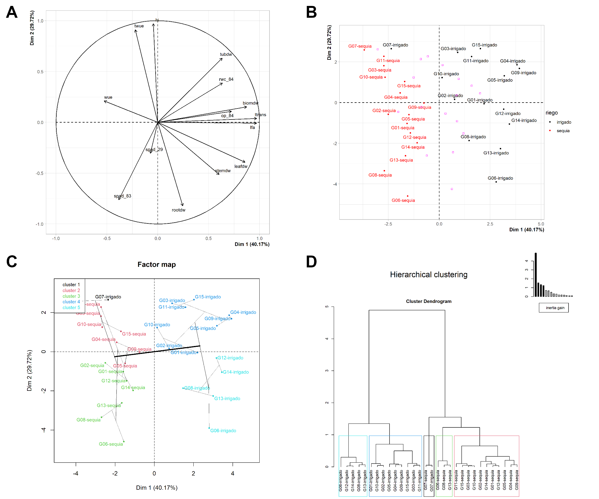

# Yupana: coding workflow

## Packages

``` r
library(inti)
library(gsheet)
library(FactoMineR)
library(cowplot)
library(png)
```

## Import data

``` r
url <- paste0("https://docs.google.com/spreadsheets/d/"
              , "15r7ZwcZZHbEgltlF6gSFvCTFA-CFzVBWwg3mFlRyKPs/edit#gid=172957346") 

# browseURL(url)

fb <- url %>% 
  gsheet2tbl() %>% 
  rename_with(tolower) %>% 
  mutate(across(c(riego, geno, bloque), ~ as.factor(.))) %>% 
  mutate(across(where(is.factor), ~ gsub("[[:space:]]", "", .)) ) %>% 
  as.data.frame()
# str(fb)
```

## Plot raw data

### Box plot

``` r
wue <- fb %>% 
  plot_raw(type = "boxplot"
           , x = "geno"
           , y = "wue"
           , group = "riego"
           , xlab = "Genotipos"
           , ylab = "Water use efficiency (g/l)"
           , ylimits = c(5, 30, 5)
           , glab = "Tratamientos"
           )
```

### Scatter plot

``` r
hi <- fb %>% 
  plot_raw(type = "scatterplot"
           , x = "hi"
           , y = "twue"
           , group = "riego"
           , xlab = "Harvest Index"
           , ylab = "Tuber water use efficiency (g/l)"
           , glab = "Tratamientos"
           )
```

### Plot in grids

``` r
grid <- plot_grid(wue, hi
                  , nrow = 2
                  , labels = "AUTO")

save_plot("files/fig-01.png"
        , plot = grid
        , dpi= 300
        , base_width = 10
        , base_height = 10
        , scale = 1.4
        , units = "cm"
        )


```


Water use effiency in 15 potato genotypes A) Box plot B) Scatter plot.

## Plot summary data

### Leaf area

``` r

#> Plot summary data

model <- fb %>% 
  yupana_analysis(response = "lfa"
                  , model_factors = "geno*riego"
                  , comparison = c("geno", "riego")
                  )

lfa <- model$meancomp %>% 
  plot_smr(type = "bar"
           , x = "geno"
           , y = "lfa"
           , group = "riego"
           , ylimits = c(0, 12000, 2000)
           , sig = "sig"
           , error = "ste"
           , xlab = "Genotipos"
           , ylab = "Area foliar (cm^2)"
           , color = F
           )

model$anova %>% anova()
## Analysis of Variance Table
## 
## Response: lfa
##             Df    Sum Sq   Mean Sq  F value                Pr(>F)    
## geno        14 261742780  18695913   33.371 < 0.00000000000000022 ***
## riego        1 788562704 788562704 1407.541 < 0.00000000000000022 ***
## geno:riego  14 108153220   7725230   13.789 < 0.00000000000000022 ***
## Residuals  120  67228987    560242                                   
## ---
## Signif. codes:  0 '***' 0.001 '**' 0.01 '*' 0.05 '.' 0.1 ' ' 1

model$meancomp %>% web_table()
```

### Tuber water use efficiency

``` r
model <- fb %>% 
  yupana_analysis(response = "twue"
                  , model_factors = "block + geno*riego"
                  , comparison = c("geno", "riego")
                  )

twue <- model$meancomp %>% 
  plot_smr(type = "line"
           , x = "geno"
           , y = "twue"
           , group = "riego"
           , ylimits = c(0, 10, 2)
           , error = "ste"
           , color = c("blue", "red")
           , 
           ) +
  labs(x = "Genotipos"
       , y = "Tuber water use effiency (g/l)"
       )

model$anova %>% anova()
## Analysis of Variance Table
## 
## Response: twue
##             Df Sum Sq Mean Sq F value                Pr(>F)    
## block        1  20.78 20.7770 31.0214          0.0000001609 ***
## geno        14 413.06 29.5046 44.0523 < 0.00000000000000022 ***
## riego        1   2.04  2.0370  3.0414               0.08375 .  
## geno:riego  14  16.07  1.1479  1.7140               0.06138 .  
## Residuals  119  79.70  0.6698                                  
## ---
## Signif. codes:  0 '***' 0.001 '**' 0.01 '*' 0.05 '.' 0.1 ' ' 1

model$meancomp %>% web_table()
```

### Plot in grids

``` r
grid <- plot_grid(lfa, twue
                  , nrow = 2
                  , labels = "AUTO")

ggsave2("files/fig-02.png"
        , plot = grid
        , dpi= 300
        , width = 10
        , height = 10
        , scale = 1.5
        , units = "cm")


```


Water use effiency in 15 potato genotypes A) Bar plot B) Line plot.

## Multivariate analysis

``` r
#> Principal component Analysis

mv <- fb %>% 
  yupana_mvr(last_factor = "bloque"
             , summary_by = c("geno", "riego")
             , groups = "riego"
             )
  
# sink("files/pca.txt")
# # Results
# summary(pca, nbelements = Inf, nb.dec = 2)
# # Correlation de dimensions
# dimdesc(pca)
# sink()

ppi <- 300
png("files/plot_pca_var.png", width=7*ppi, height=7*ppi, res=ppi)

plot.PCA(mv$pca,
         choix="var",
         title="",
         autoLab = "y", 
         cex = 0.8,
         shadowtext = T)

graphics.off()

ppi <- 300
png("files/plot_pca_ind.png", width=7*ppi, height=7*ppi, res=ppi)

plot.PCA(mv$pca,
         choix="ind",
         habillage = 2,
         title="",
         autoLab = "y", 
         cex = 0.8,
         shadowtext = T,
         label = "ind",
         legend = list(bty = "y", x = "topright"))

graphics.off()

# Hierarchical Clustering Analysis

clt <- mv$pca %>% 
  HCPC(., nb.clust=-1, graph = F)

# sink("files/clu.txt")
# clus$call$t$tree
# clus$desc.ind
# clus$desc.var
# sink()

ppi <- 300
png("files/plot_cluster_tree.png", width=7*ppi, height=7*ppi, res=ppi)

plot.HCPC(x = clt, 
          choice = "tree")

graphics.off()

ppi <- 300
png("files/plot_cluster_map.png", width=7*ppi, height=7*ppi, res=ppi)

plot.HCPC(x = clt, choice = "map")

graphics.off()

plot.01 <- readPNG("files/plot_pca_var.png") %>% grid::rasterGrob()
plot.02 <- readPNG("files/plot_pca_ind.png")  %>% grid::rasterGrob()
plot.03 <- readPNG("files/plot_cluster_map.png") %>% grid::rasterGrob()
plot.04 <- readPNG("files/plot_cluster_tree.png") %>% grid::rasterGrob()


plot <- plot_grid(plot.01, plot.02, plot.03, plot.04
                  , nrow = 2
                  , labels = "AUTO")

ggsave2("files/fig-03.png"
        , plot = plot
        , dpi = 300
        , width = 12
        , height = 10
        , scale = 1.5
        , units = "cm")


```


Multivariate Analysis: Principal component analysis and hierarchical
clustering analysis.
