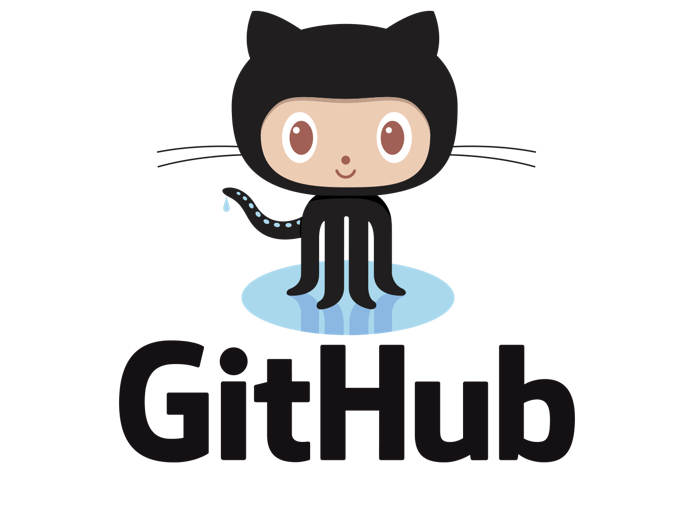

# Rticles

El paquete `inti` permite usar un plantilla (template) para la generar
documentos técnico/científicos (i.e. tesis y artículos) usando
[`Quarto`](https://quarto.org/).

## Herramientas

Para el desarrollo de documentos técnico/científicos con R, deben
crearse algunas cuentas e instalar los programas que necesitamos. La
mayoria de estas herramientas son libres e independientes del sistema
operativo y pueden ser usadas para investigación reproducible.

> La lista de herramientas es una recomendación basada en mi
> experiencia, y no son las únicas disponibles.

### Cuentas

> Se recomienda usar el mismo correo para todas las cuentas. El uso de
> correos diferentes para cada servicio dificultará el flujo de trabajo
> posteriormente.

Deben crearse una cuenta en los siguientes servicios:

1.  `Google (Gmail)`. Se recomienda que tengan una cuenta de Google ya
    que nos permitirá tener acceso a `Google Suit` que posee un conjunto
    de herramientas gratuitas en línea. Estas herramientas son un buen
    complemento para el trabajo en equipo y puedes acceder a ellos desde
    distintos dispositivos móviles.

2.  `Zotero`. Será nuestra biblioteca virtual, y una de las herramientas
    que más usaremos, ya que nos permitirá organizar nuestro trabajo y
    citar los documentos en nuestros documentos

3.  `GitHub` (opcional). Es un servicio de repositorio de código. Nos
    ayudará organizar nuestros proyectos y códigos. Nos permite
    visualizar los historiales de cambio de nuestro proyecto, compartir
    nuestro código y la posibilidad de generar páginas webs.

#### Links para crear las cuentas

[](https://accounts.google.com/signup/v2/webcreateaccount?continue=https%3A%2F%2Fwww.google.com%2F%3Fgws_rd%3Dssl&hl=es-419&dsh=S-352003840%3A1585079101705388&gmb=exp&biz=false&flowName=GlifWebSignIn&flowEntry=SignUp)

[](https://www.zotero.org/user/register)

[](https://github.com/join?source=login)

### Programas

> Instalar los programas en el orden que se mencionan para evitar
> conflictos en su funcionamiento.

1.  `Zotero`. Es un gestor de referencias bibliográficas, libre, abierto
    y gratuito desarrollado por el Center for History and New Media de
    la Universidad George Mason.

2.  `R CRAN`. Es un entorno de lenguaje de programación con un enfoque
    al análisis estadístico. El software R viene por defecto con
    funcionalidades básicas y para ampliar estas debemos instalar
    paquetes. R actualmente nos permite hacer distintas tareas comó
    análisis estadísticos, generación de gráficos, escritura de
    documentos, desarrollo de aplicaciones webs, etc.

3.  `RStudio`. RStudio es un entorno de desarrollo integrado para el
    lenguaje de programación R, dedicado a la computación estadística y
    gráficos.

4.  `Git`. Git es un software de control de versiones. Esta pensando en
    la eficiencia y la confiabilidad del mantenimiento de versiones de
    aplicaciones. Git tambien nos permitirá usar `bash` en windows a
    través del terminal en RStudio.

#### Links de los programas para instalar

[](https://www.zotero.org/download/)

[](https://cran.r-project.org/)

[](https://posit.co/download/rstudio-desktop/)

[](https://git-scm.com/downloads/)

### Extras

Alguna herramientas básicas que NO deben faltar en tú computador:

- Chrome (buscador web)
- Foxit Reader (lector de PDFs)
- WinRAR (compression/descompresor de archivos)
- Google Backup and Sync (servicio de sincronización de datos)
- ShareX (herramienta para captura de pantalla)

Los usuarios de `Windows`, pueden instalar estas aplicaciones entre
otras desde `ninite`.

[](https://ninite.com/)

### Chocolatey (opcional)

Si eres usuario de windows, puedes instalar todas las herramientas
mencionadas desde el administrador de paquetes `chocolatey` a través de
`PowerShell`.

``` r
open https://chocolatey.org/packages

Start-Process powershell -Verb runAs

Set-ExecutionPolicy Bypass -Scope Process -Force; [System.Net.ServicePointManager]::SecurityProtocol = [System.Net.ServicePointManager]::SecurityProtocol -bor 3072; iex ((New-Object System.Net.WebClient).DownloadString('https://chocolatey.org/install.ps1'))

choco install googlechrome
choco install winrar
choco install zotero
choco install r
choco install rtools
choco install r.studio
choco install git
choco install google-backup-and-sync
choco install foxitreader
choco install sharex
```
