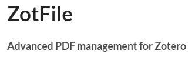

```{r setup, include=FALSE}
source("https://raw.githubusercontent.com/Flavjack/inti/master/pkgdown/favicon/docs.r")
```

El paquete `inti` posee planillas para la generación de documentos técnico/científicos usando `Rmarkdown + Bookdown`. Estas plantillas permitirán la elaboración de documentos reproducibles.

```{=html}
<p align="center"><iframe width="560" height="315" src="https://www.youtube-nocookie.com/embed/videoseries?list=PLSQMdOu57lj9HTZNed2-q3WpQfIGraA1V" title="YouTube video player" frameborder="0" allow="accelerometer; autoplay; clipboard-write; encrypted-media; gyroscope; picture-in-picture" allowfullscreen></iframe></p>
```

# Herramientas para documentos reproducibles

Para la construcción de documentos técnico/científicos con R, deben crearse algunas cuentas e instalar los programas que necesitamos. Estas herramientas son independientes del sistema operativo, de acceso libre y pueden ser usadas para la investigación reproducible.

> El listado de herramientas son una recomendación basada en mi experiencia, y no son las únicas herramientas.

## Cuentas

> Se recomienda usar el mismo correo para todas las cuentas. El uso de correos diferentes para cada servicio dificultará el flujo de trabajo.

Deben crearse una cuenta en los siguientes servicios:

1. `Google (Gmail)`. Se recomienda que tengan una cuenta de Google ya que nos permitirá tener acceso a `Gsuit` que posee un conjunto de herramientas gratuitas en línea. Estas herramientas son un buen complemento para el trabajo en equipo y puedes acceder a ellos desde distintos dispositivos móviles.

1. `Zotero`. Será nuestra biblioteca virtual, y una de las herramientas que más usaremos, ya que nos permitirá organizar nuestro trabajo y citar los documentos en nuestros manuscritos.

1. `GitHub`. Es un servicio de repositorio de código. Nos ayudará organizar nuestros proyectos y códigos. Nos permite visualizar los historiales de cambio de nuestro proyecto, compartir nuestro código y generar páginas webs para publicar documentos en línea.

### Links para crear las cuentas

```{=html}
<div id=footer style="width:100%; margin:auto;">
  <div style="display:inline-block; width:32%">

  <p style="text-align:center; vertical-align:middle"> 
  <a target="_blank" href="https://accounts.google.com/signup/v2/webcreateaccount?continue=https%3A%2F%2Fwww.google.com%2F%3Fgws_rd%3Dssl&hl=es-419&dsh=S-352003840%3A1585079101705388&gmb=exp&biz=false&flowName=GlifWebSignIn&flowEntry=SignUp"></a>  
  </p></div>
  
  <div style="display:inline-block; width:32%">
  <p style="text-align:center; vertical-align:middle">
  <a target="_blank" href="https://www.zotero.org/user/register"></a> 
  </p></div>
  
  <div style="display:inline-block; width:32%"> 
  <p style="text-align:center; vertical-align:middle"> 
  <a target="_blank" href="https://github.com/join?source=login"></a></p>
  </div>
  
</div>
```

## Programas

> Instalar los siguientes programas en el orden que se mencionan, para evitar conflictos en su funcionamiento.

1. `Zotero`. Es un gestor de referencias bibliográficas, libre, abierto y gratuito desarrollado por el Center for History and New Media de la Universidad George Mason.

1. `R CRAN`. Es un entorno de lenguaje de programación con un enfoque al análisis estadístico. El software R viene por defecto con funcionalidades básicas y para ampliar estas debemos instalar paquetes. R actualmente nos permite hacer distintas tareas comó análisis estadísticos, generación de gráficos, escritura de documentos, desarrollo de aplicaciones webs, etc.

1. `RStudio`. RStudio es un entorno de desarrollo integrado para el lenguaje de programación R, dedicado a la computación estadística y gráficos.

1. `Git`. Git es un software de control de versiones. Esta pensando en la eficiencia y la confiabilidad del mantenimiento de versiones de aplicaciones. Git nos permitirá usar `bash` en windows a través del terminal en RStudio.

### Links de los programas para instalar

```{=html}
<div id=footer style="width:100%; margin:auto;">
  
  <div style="display:inline-block; width:24%">
  <p style="text-align:center; vertical-align:middle">
  <a target="_blank" href="https://www.zotero.org/download/"></a> 
  </p></div>
  
  <div style="display:inline-block; width:24%">
  <p style="text-align:center; vertical-align:middle">
  <a target="_blank" href="https://cran.r-project.org/"></a> 
  </p></div>
  
  <div style="display:inline-block; width:24%"> 
  <p style="text-align:center; vertical-align:middle">
  <a target="_blank" href="https://www.rstudio.com/products/rstudio/download/"></a> 
  </p></div>
  
  <div style="display:inline-block; width:24%"> 
  <p style="text-align:center; vertical-align:middle"> 
  <a target="_blank" href="https://git-scm.com/downloads"></a> 
  </p></div>
  
</div>
```

#### Complementos para zotero

```{=html}
<div id=footer style="width:100%; margin:auto;">
  
  <div style="display:inline-block; width:49%">
  <p style="text-align:center; vertical-align:middle">
  <a target="_blank" href="http://zotfile.com/"></a> 
  </p></div>
  
  <div style="display:inline-block; width:49%">
  <p style="text-align:center; vertical-align:middle">
  <a target="_blank" href="https://retorque.re/zotero-better-bibtex/"></a> 
  </p></div>
  
</div>
```

## Herramientas adicionales

Existen alguna herramientas básicas que NO deben faltar en tú computador:

- Chrome (buscador web)
- Foxit Reader (lector de PDFs)
- WinRAR (compression/descompresor de archivos)
- Google Backup and Sync (servicio de sincronización de datos)
- ShareX (herramienta para captura de pantalla)

Los usuarios de `Windows`, pueden instalar estas aplicaciones entre otras desde `ninite`. 

```{=html}
<div style="display:inline-block; width:100%"> 

<p style="text-align:center; vertical-align:middle"> 
<a target="_blank" href="https://ninite.com/"></a> 
</p>
  
</div>
```

## Chocolatey (opcional)

Si eres usuario de windows, puedes instalar todas las herramientas mencionadas desde el administrador de paquetes `chocolatey` a través de `PowerShell`.

```{r, echo=TRUE, eval = FALSE}
open https://chocolatey.org/packages

Start-Process powershell -Verb runAs

Set-ExecutionPolicy Bypass -Scope Process -Force; [System.Net.ServicePointManager]::SecurityProtocol = [System.Net.ServicePointManager]::SecurityProtocol -bor 3072; iex ((New-Object System.Net.WebClient).DownloadString('https://chocolatey.org/install.ps1'))

choco install avastfreeantivirus
choco install googlechrome
choco install winrar
choco install zotero
choco install r
choco install rtools
choco install r.studio
choco install git
choco install google-backup-and-sync
choco install foxitreader
choco install sharex
choco install k-litecodecpackfull
choco install gom-player
choco install aimp
choco install teamviewer
```
